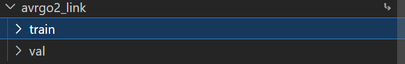
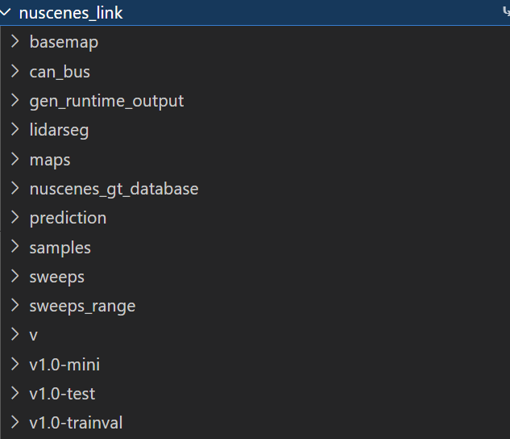
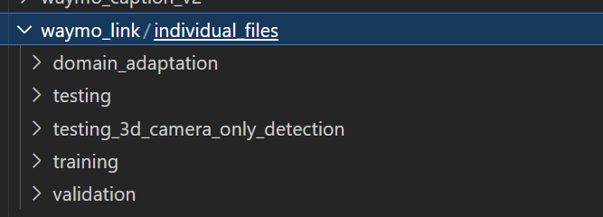
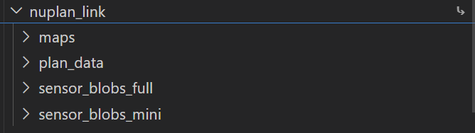

### 数据预处理：
## Argoverse

1. Download the [Argoverse 2 Sensor](https://www.argoverse.org/av2.html#download-link) dataset files to `{ARGOVERSE_ROOT}` on your file system. After the dataset is downloaded, there will be some `*.tar` files under path `{ARGOVERSE_ROOT}`.

2. Then make information JSON files to accelerate the loading speed, by:

```
PYTHONPATH=src python src/dwm/tools/dataset_make_info_json.py -dt argoverse -i {ARGOVERSE_ROOT} -o {ARGOVERSE_ROOT}
```

3. Now the `{ARGOVERSE_ROOT}` is ready to update the Argoverse file system of your config file, for [example](../configs/ctsd/single_dataset/ctsd_21_crossview_tirda_bm_argo.json#L184).

4. Download the annotation of text prompt and update the config following the section [text description for images](#text-description-for-images)

5.运行avrgo2_balanced/balance.py（内部自定义配置）
6.跑absroot.py，"""修改单个JSON文件中的绝对路径为相对路径"""
avrgoverse结构：

## Nuscenes

1.运行nuscenes_train_balanced/balance.py得到json即可
nusc结构：
因为nusc在课程区域没有办法看到另外区域的，所以我做了很多软链接到camsim根目录比如/inspire/qb-ilm/project/advanced-machine-learning/yanjunchi-24040/camsim_lyh/sweeps/inspire/qb-ilm/project/advanced-machine-learning/yanjunchi-24040/camsim_lyh/maps/inspire/qb-ilm/project/advanced-machine-learning/yanjunchi-24040/camsim_lyh/can_bus
## Waymo
There are two versions of the Waymo Perception dataset. This project chooses version 1 (>= 1.4.2) because only this version provides HD map annotation, while version 2 does not provide HD map annotation.

1. *Optional*. The Waymo Perception 1.x requires protobuffer, if you try to avoid installing waymo_open_dataset and its dependencies, you need to compile the proto files. Install the [proto buffer compiler](https://github.com/protocolbuffers/protobuf/releases/tag/v25.4), then run following commands to compile proto files. After compilation, `import waymo_open_dataset.dataset_pb2` works by adding `externals/waymo-open-dataset/src` to the environmant variable `PYTHONPATH`.

```
cd externals/waymo-open-dataset/src
protoc --proto_path=. --python_out=. waymo_open_dataset/*.proto
protoc --proto_path=. --python_out=. waymo_open_dataset/protos/*.proto
```

2. Download the [Waymo Perception](https://waymo.com/open/download) dataset (>= 1.4.2 for the annotation of HD map) to `{WAYMO_ROOT}`. After the dataset is downloaded, there will be some `*.tfrecord` files under the path `{WAYMO_ROOT}/training` and `{WAYMO_ROOT}/validation`.

3. Then make information JSON files to support inner-scene random access, by

```
PYTHONPATH=src python src/dwm/tools/dataset_make_info_json.py -dt waymo -i {WAYMO_ROOT}/training -o {WAYMO_ROOT}/training.info.json
PYTHONPATH=src python src/dwm/tools/dataset_make_info_json.py -dt waymo -i {WAYMO_ROOT}/validation -o {WAYMO_ROOT}/validation.info.json
```

4. Now the `{WAYMO_ROOT}` and its information JSON files are ready to update the Waymo dataset of your config file, for [example](../configs/ctsd/single_dataset/ctsd_21_crossview_tirda_bm_waymo.json#L182).

5. Download the annotation of text prompt and update the config following the section [text description for images](#text-description-for-images)
6.waymo跑prepossess，提取出含有的ego数据
7.运行waymo_balanced/balance.py得到json
export PYTHONPATH=$PYTHONPATH:/inspire/qb-ilm/project/advanced-machine-learning/yanjunchi-24040/camsim_lyh/OpenDWM/externals/waymo-open-dataset/src


## Nuplan
1.先用nuplan_prepo/nuplan_info.py做pkl（minival,minitrain）
2.再用nuplan_balanced/balance.py筛选
export PYTHONPATH=/inspire/qb-ilm/project/advanced-machine-learning/yanjunchi-24040/camsim_lyh/nuplan-devkit-master:$PYTHONPATH

